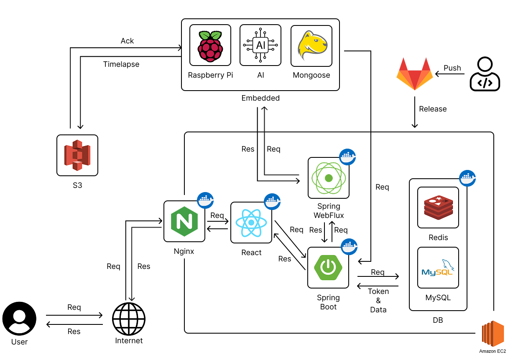
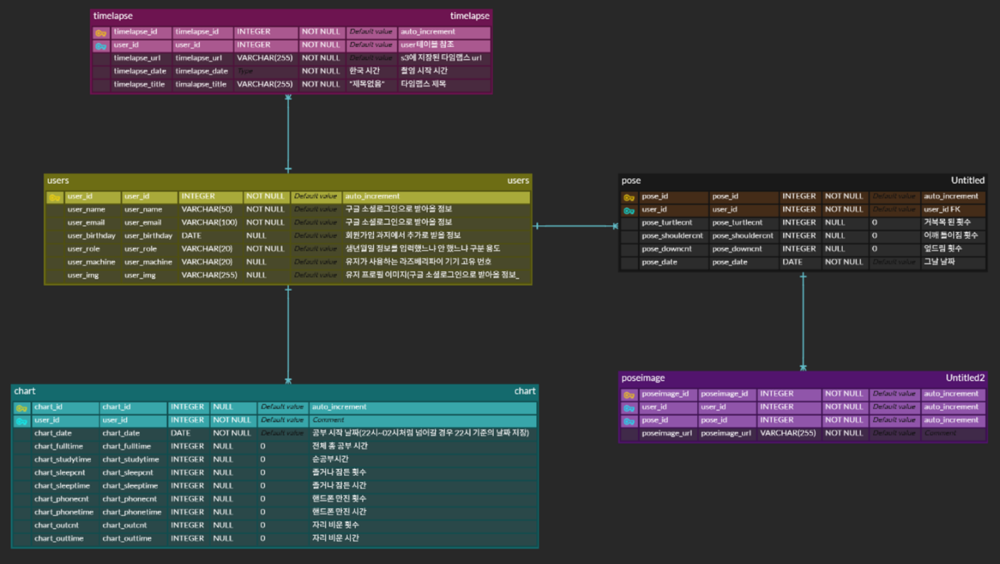

[1. 서비스 소개](#1-서비스소개)

[2. 기능 소개](#2-기능소개)

[3. 주요 기능 상세소개](#3-주요-기능-상세-소개)

[4. 기술 스택](#4-기술스택)

[5. 협업 툴](#5-협업-툴)

[6. 시스템 아키텍쳐](#6-시스템-아키텍쳐)

[7. ERD](#7-erd)


 

## 1. 서비스소개

```
학습 습관이 올바르게 잡히지 않은 청소년들을 위한!
올바른 자세를 잡기 위한!
바른 자세와 집중을 지켜주는 스마트 학습 비서 WizBee!
```

## 1) 기획배경

10대 청소년들의 거북목 증후군 환자 수가 2017년 대비 2021년에 **2배** 이상 급증했습니다.
특히 2002 ~ 2007년 생의 경우 **132%**가 증가했습니다.

또한, 한국 청소년들의 하루 평균 공부 시간은 7시간 50분으로 OECD 국가 중 가장 깁니다.
장시간 동안 책상에 앉아 공부하게 되면 올바른 자세를 유지하는 것은 어렵습니다.

위 2가지 문제를 해결하고자 바른 자세와 집중을 지켜주는 학습 비서 WizBee를 개발했습니다.

## 2. 기능소개

### 1) 타임랩스

- 공부하는 모습을 타임랩스로 촬영해 보세요.
- 촬영을 종료하면 타임랩스 영상이 저장됩니다.
- 공부를 끝마치고 타임랩스 영상을 보면서 공부하는 모습을 볼 수 있습니다.

### 2) 자세 탐지

- AI가 거북목, 어깨 틀어짐, 엎드림의 자세를 탐지합니다.
- 올바르지 못하는 자세를 오래 유지하면 알림을 보내줍니다.

### 3) 딴짓 감지

- AI가 공부 중 자리비움, 핸드폰 사용, 졸고 있는 순간을 기록합니다.
- 이를 통계화해서 웹에서 사용자의 공부 습관을 체크할 수 있습니다.

### 4) 공부 및 자세 통계

- AI가 기록한 공부 및 자세 기록을 웹에서 한눈에 파악할 수 있습니다.
- 나와 같은 또래의 통계 자료도 확인할 수 있습니다.
- 거북목, 어깨 틀어짐, 엎드림 등의 자세의 순간을 사진으로 확인할 수 있습니다.

## 3. 주요 기능 상세 소개

### 1) 타임랩스 촬영

- webFlux를 이용해 spring과 raspberry pi와 연결합니다.
- raspberry pi와 연결된 웹캠에서 타임랩스를 촬영하고 있는 모습을 사용자는 볼 수 있습니다.
- 사용자가 촬영을 종료하면 타임랩스 영상이 S3에 저장되고 사용자는 추후, 이를 확인할 수 있습니다.

### 2) 자세 감감지 AI

- mediapipe를 활용해 실시간으로 사용자의 관절의 좌표를 찍습니다. 관절 좌표를 사용해 사용자가 현재 자세(거북목, 어깨틀어짐, 엎드림)를 실시간으로 탐지합니다.
- 특정 시간동안 유지할 경우 횟수를 기록하고 이미지를 저장합니다.
- 거북목 자세의 경우 특정 시간 동안 유지될 경우 raspberry pi에서 알림을 보냅니다.
- 모델 선정 이유: openpose와 mediapipe를 비교했을 때 성능 면에서는 비슷한 양상을 보였습니다. 하지만 온디바이스 환경에서는 비교적 더 가벼운 mediapipe를 쓰는 것이 더 적합하다고 판단해 해당 모델을 사용했습니다.

### 3) 딴짓 감지 AI

- 졸음: YOLO v5와 CNN 모델을 활용해 사용자의 눈을 실시간으로 탐지하고 탐지된 눈이 뜨고 있는 상태인지 감은 상태인지 탐지합니다. 만약 눈을 감은 상태가 특정 시간 이상 지속되는 것으로 판단되면 졸음으로 판단하고 횟수와 그 시간을 기록합니다.
- 자리비움: YOLO v5를 사용해 사람 객체를 탐지합니다. 사람이 특정 시간동안 탐지되지 않는다면 자리비움으로 판단하고 횟수와 그 시간을 기록합니다.
- 핸드폰 사용: YOLO v5를 사용해 사람의 손과 핸드폰 객체를 탐지합니다. 두 객체의 좌표가 가까워지면 핸드폰 사용으로 판단하고 그 횟수와 사용 시간을 기록합니다.
- 모델 선정 이유: 여러 YOLO 버전이 있지만 v5를 선정한 이유는 다른 버전에 비해 성능면에서 뒤쳐지지 않고 가볍기 때문에 온디바스에 적합한 모델이라고 판단했습니다. 

### 4) 통계 차트 및 이미지 제공

- 딴짓 감지 AI가 기록한 자료를 통해 사용자의 공부 시간 중 핸드폰 사용 시간, 자리를 비운 시간, 졸았던 시간을 분석하고 이를 통해 순 공부 시간을 계산해 차트로 제공합니다.
- 자세 감지 AI가 기록한 자료를 통해 사용자가 공부 중 거북목, 어깨틀어짐, 엎드린 자세를 몇 번 했는지 확인할 수 있습니다. 또한, 이미지를 제공하기 때문에 거북목이나 어깨틀어짐의 정도를 파악할 수 있습니다.


## 4. 기술스택
### 1) FE
- Node.js 22.14.0
- Vite 6.2.5

### 2) BE

 - JDK 17
 - SpringBoot 3.4.3
 - Gradle
 - Spring web
 - Spring webflux
 - Spring devtools
 - Spring Security
 - Spring OAuth2
 - lombok
 - JPA
 - MySQL Driver
 - JWT 0.12.3
 - MySql 8.0
 - Redis

 ### 3) AI
- Python 3.10.11
- PyTorch 2.5.1+cu121
- TorchVision 0.20.1+cu121
- TensorFlow 2.8.0
- YOLOv5 (Ultralytics Custom)
- MediaPipe 0.10.7
- OpenCV 4.11.0.86
- NumPy 1.26.4
- Pandas 2.2.3
- Matplotlib 3.10.1
- CUDA 12.1

### 4) 임베디드
- nginx 1.22.1
- ngrok version 3.22.0
- aws-cli 2.25.6
- mongoose 7.17

### 5) 인프라
- Doker
- Nginx
- AWS EC2
- Ubuntu 20.04.5 LTS
- Debian GNU/Linux 12

## 5. 협업 툴
### 1) Git Lab
### 2) Jira
### 3) Notion
### 4) Figma

## 6. 시스템 아키텍쳐


## 7. ERD



